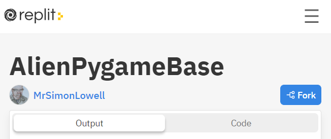
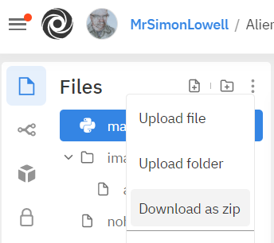
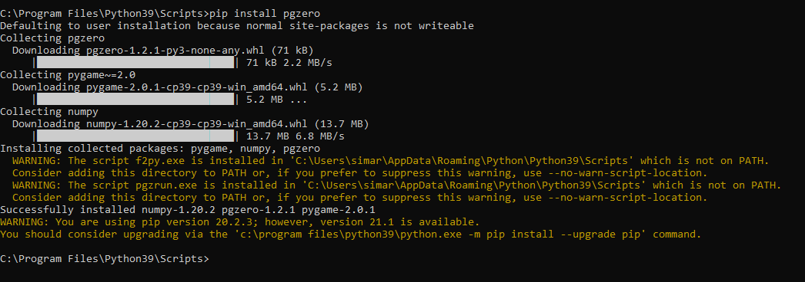

Alien Pygame
===========
One of Python's great strengths is the number of useful libraries (like Turtle graphics) that are available. In this assignment we will use Pygame Zero, a game making library, to make a simple alien game. We will be working through [this introduction to Pygame Zero](https://pygame-zero.readthedocs.io/en/stable/introduction.html). You may find slides 308 - 345 of the [slide presentation](https://docs.google.com/presentation/d/1rICcmNbnGYsB-cV_6EatPyzcOS2sId80Jh2kayUzm4Q/edit?usp=sharing) helpful in completing this assignment.

Suggested steps to get started:
---------------------------------
1. It will be easiest to do this assignment on replit. If you prefer to work on your Windows PC or Mac you can download the free [Mu Python code editor](https://codewith.mu/). (It's possible to use the standard IDLE editor on a PC, see [the instructions below](#installing-pygame-on-a-windows-pc-running-idle), but be warned that configuring Pygame to work with IDLE will require using the command prompt) 
2. If you are working on replit, start by forking [this replit](https://replit.com/@MrSimonLowell/AlienPygameBase). "Forking" means making a copy to your replit account. Once you have opened [the replit](https://replit.com/@MrSimonLowell/AlienPygameBase) click the blue Fork button.   
  
3. If you are working on your PC or Mac, go to the [same replit](https://replit.com/@MrSimonLowell/AlienPygameBase), click the three vertical dots, and choose *Download as zip*   
   
Extract the downloaded folder to the folder where you store your other Python programs. Open `main.py` from the extracted folder in Mu or IDLE. 
4. Run the program. You should see the following output:   
    
5. Now we'll make the alien do something when we click on it. Add the following function to your program   
```python
def on_mouse_down(pos):
    if alien.collidepoint(pos):
        print("Eek!")
    else:
        print("You missed me!")
``` 
6. Now when you attempt to click on the alien you should see the results in the console
7. The console is a great place to check if something is working, but we don't want to use the console for our finished game. Now we'll change the picture and play a sound depending on whether or not we clicked on the alien (Unfortunately, sounds in Pygame aren't supported on repl.it). Modify `on_mouse_down` the following code
```python
def on_mouse_down(pos):
    if alien.collidepoint(pos):
        sounds.eep.play() #doesn't work on repl.it
        alien.image = 'alien_hurt'
    else:
        sounds.missed.play() #doesn't work on repl.it
```
8. Now when you click on the alien, you should hear a sound, and the alien image will change to an unhappy alien. If you miss, you should hear a different sound. There’s a bug in this game though; the alien doesn’t ever change back to a happy alien. Let’s fix this next.
9. We'll begin the fix by moving the code that changes the image of the alien to two different functions and calling one of the functions from `on_mouse_down`.
```python
def on_mouse_down(pos):
    if alien.collidepoint(pos):
        set_alien_hurt()
        sounds.eep.play()
    else:
        sounds.missed.play()
        
def set_alien_hurt():
    alien.image = 'alien_hurt'
    
def set_alien_normal():
    alien.image = 'alien'
```
10. That change didn't make any difference in the way the game works *yet*. But it allows us to schedule a clock to change the alien back to happy after one second. Modify the `set_alien_hurt` function with the following code:
```python
def set_alien_hurt():
    alien.image = 'alien_hurt'
    clock.schedule_unique(set_alien_normal, 1.0)
```
11. Now you should have the basics of the game working. Time to get creative!

Extensions
----------------------------------------------
Explore the [Pygame Zero Reference](https://pygame-zero.readthedocs.io/en/stable/) to read about other features you can add. Feel free to modify the game any way you like. You can add a score, your own art work, sounds, and other features. You can add additional aliens and have them move in random walk pattern. Your alien game doesn't have to work or look like any other, or even have any aliens. Have fun and be creative!

Installing Pygame on a Windows PC running IDLE
----------------------------------------------
1. Installing Pygame on a Windows PC that uses IDLE is not straightforward. It requires using the command prompt to install the Pygame Zero library. If you are comfortable with the command prompt, you will need to navigate to the `Scripts` folder where you installed Python 3. On my system I could navigate to the scripts folder with the command `cd \Program Files\Python39\Scripts`.
2. Now type the command `pip install pgzero`. This is what it looked like after I typed the command to install Pygame Zero:   
   
4. Pygame and Pygame Zero are now succesfully installed! (If IDLE was open during the Pygame Zero installation, you will need to close IDLE and reopen it before you can start coding)  

Samples of Student work
-----------------------
*none yet!*
